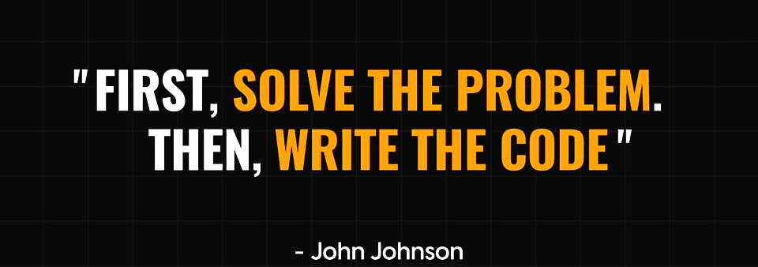

# Hello World! I'm Divyam 👋:
 🎓 Computer Science Student 🧮 Exploring Data Analytics and Data Science for real-world applications 🛡️ DIY Enthusiast: Built my own VPNs (OpenVPN & WireGuard) for gaming 🕹️ Optimizing my devices to get low ping while playing Valorant  🌱 Currently Learning:  - Starting to learn Front-End Development - Modern web frameworks for analytics dashboards - Advanced Data Visualization Techniques  

# 💻 Tech Stack:
               

## 📫 Connect with Me:
  
